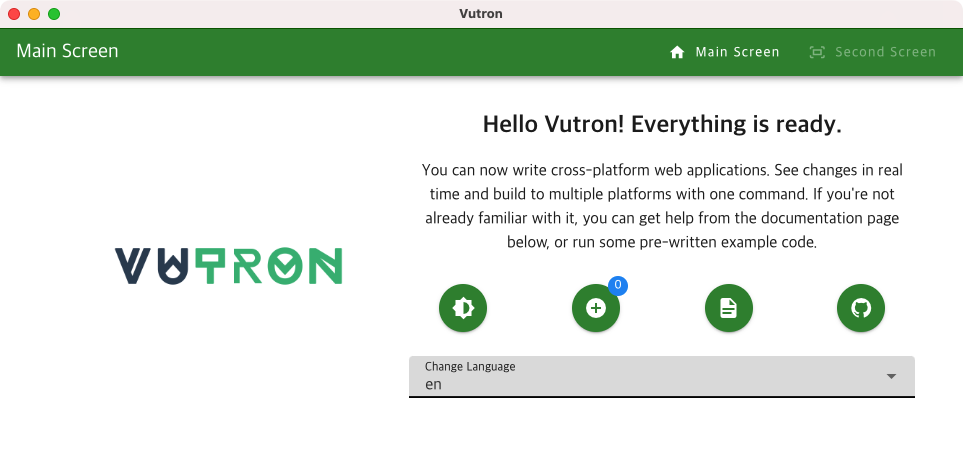

Quick Start Templates for **[Vite](https://vitejs.dev)** + **[Vue 3](https://vuejs.org)** + **[Electron](https://www.electronjs.org)**

      

**Vutron** is a preconfigured template for developing `Electron` cross-platform desktop apps. It uses `Vue 3` and allows you to build a fast development environment with little effort.

## Advantages of use

- ✅ You can build immediately without any presets, so you can develop quickly.
- ✅ It is being maintained quickly to be compatible with the latest `Vue` and `Electron`, as well as many modules.
- ✅ There is no need to worry about layout and data management by using various additional templates.

## Features

- ⚡️ Rapid development through hot-reload
- ⚡️ Cross-platform development and build support
- ⚡️ Multilingual support
- ⚡️ Support for themes (dark & light)
- ⚡️ Basic layout manager
- ⚡️ Global state management through the Pinia store
- ⚡️ TypeScript support

## [Getting Started & Documentation](https://vutron.jooy2.com)

For complete documentation including installation instructions and basic usage, please refer to each item in the link below: https://vutron.jooy2.com

## Contribute

You can report issues on [GitHub Issue](https://github.com/jooy2/vutron/issues). You can also request a pull to fix bugs and add frequently used features.

## License

Copyright © 2022-2023 [Jooy2](https://jooy2.com) <[jooy2.contact@gmail.com](mailto:jooy2.contact@gmail.com)> Released under the MIT license.
